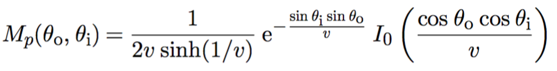

Rendering Final
===============

|學號|姓名|
|----|----|
|r05922033|廖苡彤|
|r05944045|陳卓晗|

## I. Curve 實作
雖然三角形也可以用來渲染細長的模型，但是用Curve Shape可以更精確而且更有效率地描述頭髮、毛髮等模型。  

### Curve Shape
Curve Shape用cubic bezier splines來描述，每一根curve由四個控制點來定義，p0，p1，p2和p3。Curve會通過四個控制點的起點和終點，中間的點則由下面這個算式計算出：    
  
  

然後，讓curve上的點沿著與curve垂直的兩個方向分別偏移width的寬度，就可以得到這個curve的表面。  


Curve有三種類型，分別是：  

1. Flat: 這種類型的curve的表面總是和與其相交的射線垂直，通常可以用來描述比較遠的毛髮；  
2. Cylinder：這種類型的Curve會根據表面上的點的位置計算各自的normal，來模擬出cylinder的形狀。可以用來繪製意大利麵等圓柱狀的物體；  
3. Ribbon：橫截面不為圓形的物體會用這種類型的curve來繪製，比如草和葉子。  

在實作中，會用CurveCommon來保存每根Curve的控制點，以及Curve的寬度。如果Curve是Ribbon類型的話還會保存Curve起點和終點處的normal向量，用於計算ribbon中間點的扭曲程度。

### Bounding Box
由於Curve可能會很扭曲，所以Curve的Bounding Box可能會非常大。為了讓它的Bounding Box更細緻地包住Curve，在計算時我們將每個Curve再細分成不同的segment，每個segment會包括Curve上大概u長度的範圍。  

因為有每個Bezier Curve都會落在自己的控制點所組成的Convex Hull之內這個特性，所以Curve的Bounding Box可以根據這個特性計算得出。我們首先計算出沿著curve中線的2D的Bounding Box，再根據Curve的寬度，把它擴展成3D的Bounding Box。

但是由於CurveCommon結構中記錄的是整條Curve的控制點，所以具體到每個segment的時候需要重新計算segment的四個控制點。這可以通過Blossoming的方法計算得出，具體得到的一個segment的控制點如下圖所示：  
  

### Intersect
因為Curve可能很長，而且一開始檢測的Curve的Bounding Box可能有很多冗餘的空間。所以使用一種遞歸的方式檢測Curve和Ray是否有交點。當進行Intersect的檢測時，如果Ray和Curve segment的Bounding Box沒有交點，則丟棄這個segment；如果有交點，則將Curve分成左右兩個segment繼續做檢測。  

```
Intersect(){
	<建立Curve初始的Bounding Box，并做檢測>;  
	<建立射線空間>; (PART I)  
	<調用recursiveIntersect做遞歸檢測并做交點計算>;  
}

recursiveIntersect(){
	<判斷射線和Curve segment是否可能有相交，以及是否需要進一步細分做檢測>; (PART II)  
	<計算射線和Curve的交點>; (PART III)  
	<計算交點處的DifferentialGeometry>; (PART IV)  
}
```
#### PART I
為了方便做Ray和Curve相交的計算，我們首先建立一個射線空間。這個射線空間以Ray的起點做原點，Ray的方向當做+z軸，使用LookAt()方法建立（LookAt()方法中的Up使用的是和Ray.d隨機的垂直向量）。然後將Curve轉換到這個射線空間中做運算。  

#### PART II
計算射線和Curve segment是否可能會相交時，因為Curve已經被轉換到射線空間，而+z軸就是射線的方向。所以可以根據Bounding Box的(x, y)坐標來快速地判斷它與Ray是否可能有交點，如下圖所示：  


#### PART III
當計算射線是否和Curve的某個segment的表面有相交的時候，我們首先得計算出segment的邊緣線，就是和segment的起點和終點垂直的線，這樣才能判斷交點是否落在這個segment之內。計算這條兩條邊緣線各自需要兩個點，第一個點可以用控制點，第二個點則需要計算和曲線垂直的向量，當做控制點偏移的向量，如下圖所示：  
  

然後，我們需要計算curve segment上離(0, 0)點最近的點的u值。如果這個u值不超過curve的width/2的話，那麼射線和Curve的表面有交點。為了更有效地計算這個u值，我們用如下圖中虛線段的linear segment來做近似。因為curve已經被細分過多次，所以curve本身和linear segment的誤差不會太大。  
  

我們通過一個參數w，沿著起點p0到終點p3來近似出這條line segment，線上位於p0的點的w = 0，位於p3的點w = 1。而Curve segment上的點p和linear segment上對應的點p’的連線應該與p0到p3的連線垂直。  
  

通過上面的圖，可以算出p(0, 0)點在line segment上投影的w值：  


通過這個w值，可以計算出p點離line segment的最近距離。接下來，u的值就可以通過segment的u0和u1值和w值通過插值得到。同時curve上在u點處的寬度也可以計算得出。  

對于Ribbon類型的curve來說，curve的表面不總是面對這射線，所以u點處的法向量需要根據curve兩個端點的normal，用spherical linear interpolation插值得出，而curve某點的寬度則需要根據射線的方向和curve的方向做縮放，這樣才能產生ribbon的效果。

最後，為了確定射線是否和curve的表面有交點。由於射線的起點在原點，所以在這裡我們只需要檢查curve的u點處坐標(x, y)到(0, 0)的距離，然後用判斷這個距離是否小於width/2即可。u點的坐標可以通過w值，用bezier function計算得出。

另外，我們還需要判斷交點的t值，即射線坐標下交點的z值有沒有超過射線允許的最大值。


#### PART IV
如果射線和Curve確實有交點，接下來我們就可以算出交點的v值。v值的範圍是[0, 1]，並且Curve中線處的v值為0.5，根據交點離中點的距離，和交點是在中點的上方還是下方，可以計算出交點的v值。  

最後，交點處的dpdu可以根據Bezier Function得出。當計算dpdv時，如果是ribbon類型的curve，由於交點處還有一個normal值，所以我們用這個normal值和dpdu來計算dpdv。如果是flat或者是cylinder類型的curve，我們需要先將dpdu轉換到射線空間，因為這個時候dpdu和dpdv都會在xy平面上，可以很容易計算出dpdv，再將其轉換到物件空間。當然，計算cylinder的時候還要將邊緣處的dpdv往垂直于dpdu的方向做適當的偏移，這樣才會有cylinder的效果。

## II. Hair 實作
我們主要根據的是 *A Practical and Controllable Hair and Fur Model for Production Path Tracing* 這篇paper所提出的關於頭髮的實作。

### Geometry
因為curve可以想成是一個circle沿著beizer curve掃過，是一種generalized 的cylinder。這樣的型態跟我們頭髮的型態很像，所以可以用來建立頭髮的model，也可以把計算交點簡化為計算ray和cylinder的intersection。

### Hair Scattering Model
在建立scatter model前，其實首先要先對頭髮的物理組成有所認識才能模擬。而paper中提到了他們對頭髮物理組成的了解，以及基於這些瞭解而對scattering model進行的假設。

### 物理組成：
cuticle: 是頭髮的最外層，和空氣交界的部分，但表面不是平整的，而是有傾斜角度的鱗片狀所組成，如下圖。  
     
cortex: 是頭髮最外層和中心的中介處，主要有吸收光線的色素。  
Medulla：是頭髮最核心的部分。

### 模型假設
1. 用rough dielectric cylinder with scales 來model 頭髮的cuticle部分，此處便是使用pbrt-v2 core/reflection.cpp裡面的FrDiel。
2. 把頭髮內部視為單純只會吸收光線的homogeneous medium。
3. 假設入射光和反射光都是在同一點，所以使用BSDF。

### 入射光夾角簡化計算
關於計算light的入射角，paper中也提到了一個較簡易的方式，如下：  

假設入射方向為w，curve切面如下圖，畫一條與w垂直且通過圓心的線，h則是計算light的延長線與此線的交點與圓心的距離。而我們也可以用curve裡的參數v來得到h值，h = −1 + 2v 。而要得到light的入射角，我們便可以利用到h值，因為左圖其實就等於一個unit circle，於是γ 便可以用sin-1(h)得到。  
     

### BSDF
計算頭髮的BSDF，將不同平面的scattering分開考慮會較容易，paper中提到可以將scattering拆成兩個平面來計算：一個是在longitudinal plane上的scattering，利用到curve的性質；另一個則是在azimuthal plane上的scattering。  

而在所有關於light-curve interaction的計算上，我們皆是使用極座標(θ, φ) 表示，其中，θ是longitudinal angle，指的是光的入射角和normal plane的夾角；而φ則是azimuthal angle ，是將ray投影到normal平面後，和y軸的夾角。  
如下圖：  
    

### Brief Intro of Scattering
當光線打到頭髮，實際上會有很多次scattering，如下圖：  
    
p = 0, 是第一次的反射;  
p = 1，是折射後，再從另外一側折射出去;  
p = 2，是折射後，在內部反射，再從同一側折射出去;   

計算每次scattering便是考慮兩個平面的scattering節果，以及在scattering過程中產生的attenuation，於是便可以用下面式子得到我們每一次scattering的BSDF:  
    
其中，Mp指的是longitudinal scattering function，Ap是attenuation function，Np是azimuthal function，這幾個是我們最主要implement的部分。  

再將所有的scattering節果加總得到hair的BSDF如下  
  
但在程式裡，為了簡化運算，我們只會計算前三個scattering的結果，其他更高次的scattering皆用一個constant替代。   

### Implementation of BSDF (Longitudinal scattering, Absorption, Azimuthal scattering)
BSDF裡6個主要的變數：  
h: 上面提到的簡化計算入射角(gamma)用到的參數，範圍為[-1,1]  
eta: 頭髮內部的折射率  
sigma_a: 頭髮內部的吸收率  
beta_m: 頭髮在longitudinal方向的粗糙程度，範圍為[0,1]  
beta_n: 頭髮在azimuthal方向的粗糙程度，範圍為[0,1]  
alpha: 頭髮上每個小鱗片和cylinder的傾斜角度，用degree表示  

在HairBSDF的constructor裡，我們主要是初始化上面的六個變數，並計算之後會用到的與每個變數有關的運算值:  

1. 計算longitudinal的粗糙程度在每次scattering造成的variance，在這邊，因為我們只計算前面三次scattering的相關變數，所以是讓之後的scattering都等於一個constant(第二次scattering造成的variance)  
2. 根據azimuthal 的粗糙程度計算logistic scale factor  
3. 考慮到因為頭髮鱗片的傾斜，在每次反射折射都會因為這個alpha角造成射線的偏移，會需要用到sin(2^k α) and cos(2^k α)，所以在這邊預先計算。  

在HairBSDF的f裡，我們是進行Brief Intro of Scattering裡提到的每一次scattering的BSDF計算，並將其加總得到hair的BSDF，以下為Pseudo Code:
```
Spectrum HairBSDF::f(const Vector &wo, const Vector &wi) const {
    <算出入射光wo和反射光wi的θ的cosine及sine值, 再利用wo和wi的y、z方向取arctan得到入射光和反射光的φ值>  
    <根據eta(介質折射率)，算出折射後的sin(θ)值，再利用sin(θ)求得cos(θ)>  
    <根據eta(介質折射率)，算出折射後的gamma值> 
    (PART I)  
    <考慮absorsion in hair，根據Beer’s law，計算光線在頭髮中經過的路徑長，便可利用sigma_a(頭髮內部吸收率)以及前面算出的折射後的sin θ及gamma，算出transmitance > 
    (PART II)  
    <根據公式Ap = (1 - f)^2 * T^p * f^(p-1)，得到每次scattering的attenuation factor ap[]，主要是利用FrDiel這個core/reflection.*就有implement的function來計算>  
    <利用計算好的Mp、Ap、Np，得到每次scattering的貢獻，再將其加總除以修正項AbsCosTheta(wi)，得到最後的BSDF>  
    (PART III: Mp, PART IV: Np)  
}
```

#### PART I
此處要考慮的是eta在longitudinal方向的貢獻，因此我們將eta進行修正，如下：   
   
又因為h = sin γo，我們便可以利用Snell’s law去計算 γt = h/etap  

#### PART II
光線在頭髮中經過的路徑長計算方式如下圖，得la/2 = cos(rt)：  
   
但在考慮光線是經過一個cylinder如下圖，最後得到的路徑長為 l = (2cos(γt))/cos(θt).  
   
最後再根據Beer’s law，得到transmittance.

#### PART III
主要是實作下面這個式子：  
  
其中，v是之前HairBSDF constructor裡預先算好的roughness variance，I0則是modified Bessel function。  

#### PART IV
首先先算出入射、反射光在azimuthal方向的角度變化：  
  
接下來，將φ做差分得到dφ，再利用trimmed logistic得到最後的Azimuthal scattering spectrum  

### Sampling
#### Computing Additional Sample Values
因為要描述wi，我們需要有4個samples，但pbrt的BxDF::Sample_f() 只會提供2個sample，因此需要想辦法再額外生出另外兩個sample：一種方法是BxDF裡面sample的數量，但很多sampler在sample lower dimension都有比較好的samples；另一種方法則是利用從sampler那邊得到的兩個sample，在想辦法創造另外兩個sample。  

我們這邊實作的就是利用後面那種方式，利用DemuxFloat() function，將一個介於[0,1]之間的sample，在保留層級的狀況下，分解成“一對”samples：
主要想法是來自於morton curve，將取得的sample(假設是32bit)，向右位移32bits，分別取奇數位、與偶數位數字組成新的32-bit的數字。

#### A Distribution for Sampling P
因為要進行importance sampling，我們需要根據PDF才能決定哪些位置被sample到的機率會比較大，因此需要計算Ap的PDF。我們實作在HairBSDF::ComputeApPdf裡，利用std::accumulate將傳入此function的Ap進行累積，並回傳整個PDF。

#### Sampling Incident Directions
首先，利用前面的DemuxFloat從兩個samples生成四個samples，利用這四個samples去形成入射光wo，並根據此計算wi的相關變數，同時要考慮到頭髮的鱗片組成所造成的反射線、折射線偏移。最後回傳根據這組wo、wi所得到的hair BSDF。

##III. 執行環境及配置
|SYS OS|CPU|Memory|Cores|
|----|----|----|----|
|Debian|2.10GHz Intel(R) E5-2620|128GB|24|

##IV. 結果圖
<b>Result for Curve:</b>    
以下是我們生成curve所得到的結果，分別是使用不同的curve type所render出來的結果，而使用的pbrt檔則是我們根據pbrt example所自己寫的：  
Important PBRT Fragment:
```
LookAt 20 100 100   0 -1 0 0 1 0  
--------------------------------
Shape "curve" "float width" [5.0] "string type" "cylinder" "point P" [
0.0 -20.0 0.0
0.0 10.0 0.00
0.0 -10.0 0.0
0.0 20.0 0.00
]
```
Result Image:
<table width="200" border="0">
　<tr>
　<td>flat: </td>
　<td>Cylinder:</td>
  <td>Ribbon:</td>
　</tr>
</table>

<b>Result for Hair:</b>    
以下是我們實作hair的結果，在建構模型的時候運用到的是Curve shape(type: cylinder)，部分PBRT如下：
```
Shape "curve" "string type" [ "cylinder" ] "point P" [ -0.417543 15.3533 -1.06839 -0.422991 15.4336 -1.06742 -0.420546 15.5172 -1.06813 -0.416833 15.5945 -1.0825 ] "float width0" [ 0.005593 ] "float width1" [ 0.005333 ]   
Shape "curve" "string type" [ "cylinder" ] "point P" [ -0.422991 15.4336 -1.06742 -0.420546 15.5172 -1.06813 -0.416833 15.5945 -1.0825 -0.418476 15.656 -1.1225 ] "float width0" [ 0.005507 ] "float width1" [ 0.005246 ]   
Shape "curve" "string type" [ "cylinder" ] "point P" [ -0.420546 15.5172 -1.06813 -0.416833 15.5945 -1.0825 -0.418476 15.656 -1.1225 -0.428516 15.6973 -1.19701 ] "float width0" [ 0.005420 ] "float width1" [ 0.005160 ]   
```
而實作的結果如下，可以看到頭髮沒有什麼光澤顯得很粗糙，可能是由於參數的問題，也可能是由於GeometryShading或是BSDF部分出了一些問題：   
Straight Hair:
<table width="200" border="0">
　<tr>
　<td>White Hair: </td>
　<td>Yellow Hair:</td>
  <td>Gray Hair:</td>
　</tr>
</table>
Curly Hair:
<table width="200" border="0">
　<tr>
　<td>White Hair: </td>
　<td>Yellow Hair:</td>
  <td>Gray Hair:</td>
　</tr>
</table>
RGB for White hair: (0.4, 0.42, 0.4)   
RGB for Yellow hair: (0.44, 0.25, 0.078)   
RGB for Gray hair: (0.1, 0.1, 0.1)   

